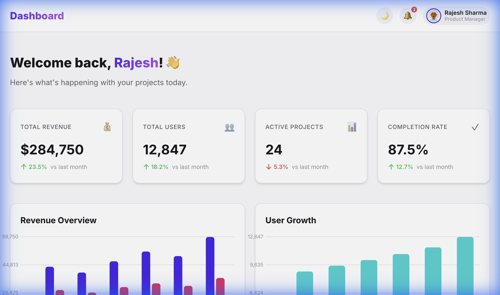
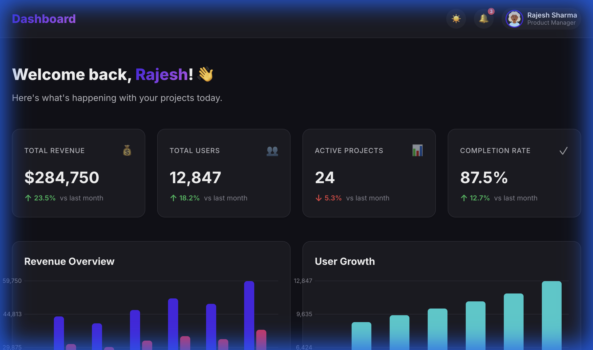
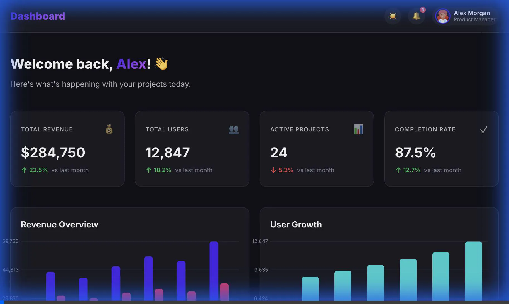

# 🚀 Modern Analytics Dashboard

A beautiful, responsive analytics dashboard built with React, TypeScript, and Vite. Features stunning UI/UX with dark mode, interactive charts, real-time data visualization, and smooth animations.


## ✨ Features

### Core Features
- **📊 Interactive Data Visualization** - Custom-built chart components with smooth animations
- **🌓 Dark/Light Mode** - Seamless theme switching with persistent preferences
- **📱 Fully Responsive** - Optimized for desktop, tablet, and mobile devices
- **⚡ Real-time Updates** - Dynamic data rendering from mock JSON
- **🎨 Premium Design** - Modern glassmorphism effects and gradient accents
- **🔔 Notifications System** - Badge indicators for new activities

### Dashboard Sections
1. **Key Metrics Cards** - Revenue, Users, Projects, Completion Rate with trend indicators
2. **Revenue Overview Chart** - Multi-series bar chart showing revenue, expenses, and profit
3. **User Growth Chart** - Visual representation of user acquisition trends
4. **Activity Feed** - Real-time activity stream with color-coded action types
5. **Top Products** - Ranked list of best-performing products with growth metrics

### Advanced Features (Bonus)
- **Custom Chart Library** - Built from scratch without external dependencies
- **Micro-animations** - Smooth fade-in, slide-in, and hover effects
- **Glassmorphism UI** - Modern frosted glass aesthetic
- **Color-coded Data** - Intuitive visual hierarchy with semantic colors
- **Accessibility** - Keyboard navigation and ARIA labels

## 🛠️ Tech Stack

- **Framework:** React 18 with TypeScript
- **Build Tool:** Vite 7
- **Styling:** Vanilla CSS with CSS Variables
- **Fonts:** Google Fonts (Inter)
- **Data:** Mock JSON (no external API dependencies)

## 📦 Installation & Setup

### Prerequisites
- Node.js (v16 or higher)
- npm or yarn

### Steps

1. **Clone the repository**
   ```bash
   git clone <repository-url>
   cd assignment27
   ```

2. **Install dependencies**
   ```bash
   npm install
   ```

3. **Start development server**
   ```bash
   npm run dev
   ```

4. **Open in browser**
   ```
   Navigate to http://localhost:5173/
   ```

### Build for Production
```bash
npm run build
npm run preview
```

## 📁 Project Structure

```
assignment27/
├── src/
│   ├── components/
│   │   ├── Card/
│   │   │   ├── Card.tsx
│   │   │   └── Card.css
│   │   ├── StatCard/
│   │   │   ├── StatCard.tsx
│   │   │   └── StatCard.css
│   │   ├── Chart/
│   │   │   ├── Chart.tsx
│   │   │   └── Chart.css
│   │   ├── ActivityFeed/
│   │   │   ├── ActivityFeed.tsx
│   │   │   └── ActivityFeed.css
│   │   └── Header/
│   │       ├── Header.tsx
│   │       └── Header.css
│   ├── data/
│   │   └── mockData.json
│   ├── App.tsx
│   ├── App.css
│   ├── index.css
│   └── main.tsx
├── public/
├── index.html
└── package.json
```

## 🎨 Design System

### Color Palette
- **Primary:** `hsl(250, 84%, 54%)` - Vibrant purple
- **Secondary:** `hsl(340, 82%, 52%)` - Pink accent
- **Success:** `hsl(142, 71%, 45%)` - Green
- **Warning:** `hsl(38, 92%, 50%)` - Orange
- **Danger:** `hsl(0, 84%, 60%)` - Red

### Key Design Principles
1. **Consistency** - Unified spacing, typography, and color system
2. **Hierarchy** - Clear visual importance through size and color
3. **Feedback** - Interactive elements respond to user actions
4. **Performance** - Optimized animations and efficient rendering

## 🎯 Key Components

### StatCard
Displays key metrics with trend indicators and icons.
```tsx
<StatCard
  title="Total Revenue"
  value="$284,750"
  change={23.5}
  icon="💰"
/>
```

### Chart
Custom-built chart component with multiple data series.
```tsx
<Chart
  title="Revenue Overview"
  data={revenueData}
  xKey="month"
  yKeys={['revenue', 'expenses', 'profit']}
/>
```

### ActivityFeed
Real-time activity stream with color-coded actions.
```tsx
<ActivityFeed activities={recentActivities} />
```

## 📊 Mock Data Structure

The application uses comprehensive mock data including:
- User profile information
- Key performance metrics
- Revenue and expense data (6 months)
- User growth statistics
- Project status distribution
- Recent activity logs
- Top product performance
- Team performance scores

## 🎬 Screenshots & Demo

### Light Mode


### Dark Mode


### Demo Recording
The dashboard includes smooth animations, theme switching, and interactive charts.



## 🚀 Deployment

This project is deployed on [Netlify/Vercel]:
**Live Demo:** [Your deployment URL]

### Deploy to Netlify
```bash
npm run build
# Upload dist/ folder to Netlify
```

### Deploy to Vercel
```bash
npm run build
vercel --prod
```

## 💡 Assumptions & Design Decisions

1. **No External Chart Libraries** - Built custom chart components to demonstrate coding skills and reduce bundle size
2. **Mock Data Only** - Used static JSON to focus on frontend implementation without backend dependencies
3. **Dark Mode Default** - Modern users prefer dark mode, set as default theme
4. **Mobile-First Approach** - Responsive design ensures usability across all devices
5. **Performance Optimized** - Minimal dependencies, efficient CSS, and optimized animations

## 🎁 Bonus Features Implemented

- ✅ **Custom Data Visualization** - Hand-crafted chart components
- ✅ **Advanced UI Features** - Glassmorphism, gradients, micro-animations
- ✅ **Creative UX** - Smooth transitions, hover effects, and visual feedback
- ✅ **Theme Switching** - Complete dark/light mode implementation
- ✅ **Responsive Design** - Fully optimized for all screen sizes
- ✅ **Clean Code Architecture** - Component-based structure with TypeScript

## 📝 Code Quality

- **TypeScript** - Type-safe code with interfaces
- **Component Modularity** - Reusable, single-responsibility components
- **CSS Architecture** - Design system with CSS variables
- **Naming Conventions** - Clear, descriptive naming
- **Comments** - Strategic documentation where needed

## 🔧 Browser Support

- Chrome (latest)
- Firefox (latest)
- Safari (latest)
- Edge (latest)

## 📄 License

This project was created as part of a frontend development assessment.

## 👨‍💻 Author

**Akshay Agrawal**

---

**Note:** This project demonstrates modern frontend development practices including responsive design, component architecture, state management, and advanced CSS techniques. All code is original and written specifically for this assessment.
